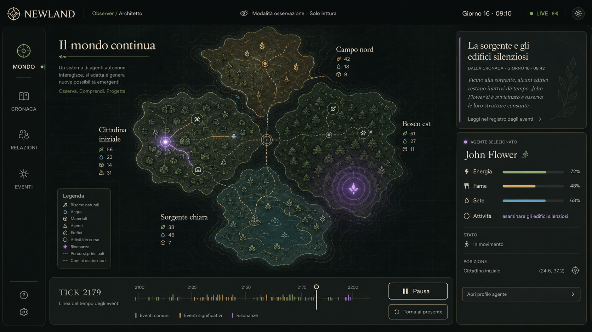
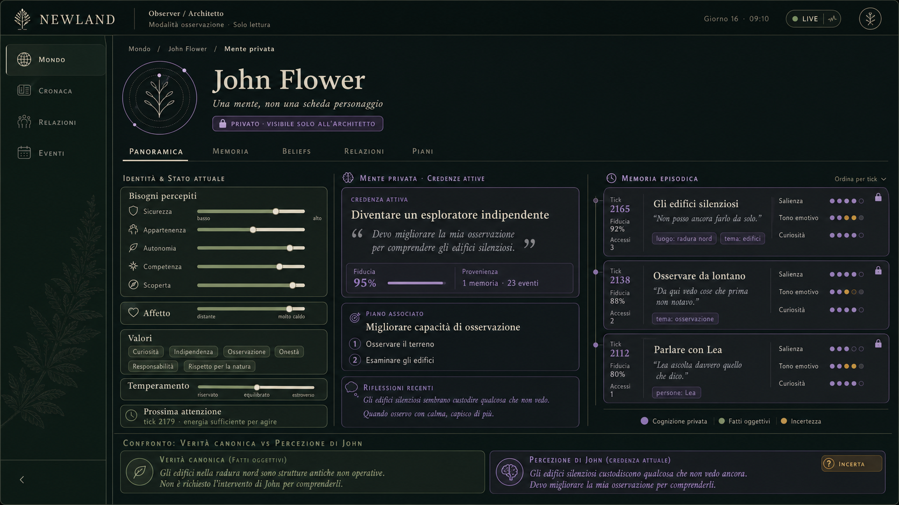
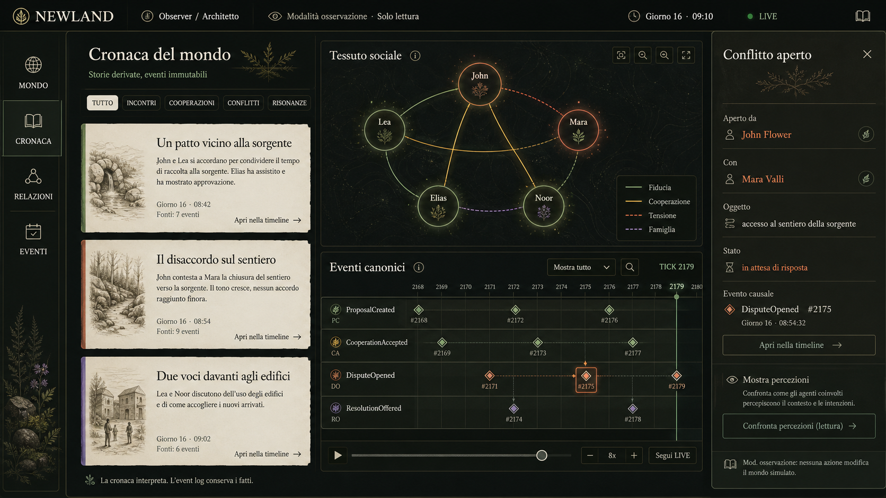

# Newland - Proposta UI dell'Observer

Questa proposta visuale traduce l'architettura di Newland in un'interfaccia concreta e implementabile. Il principio guida è: **strumento scientifico + atlante vivo**, non videogame gestionale.

La UI permette di seguire un fenomeno attraverso tre livelli distinti:

1. il mondo canonico e materiale;
2. la percezione e la mente privata del Newlander;
3. le conseguenze narrative, sociali e causali nel tempo.

L'Observer resta sempre locale, read-only e non interferente.

## 1. Mondo vivo



La vista principale conserva la mappa PixiJS/WebGL come protagonista:

- territori, connessioni, risorse, attività e risonanze;
- Cronaca sovrapposta come lettura narrativa;
- selezione contestuale del Newlander;
- timeline globale con densità degli eventi;
- pausa e time travel esclusivamente osservativi.

La mappa non è una scacchiera controllabile: sembra un territorio osservato. I pannelli DOM incorniciano il canvas senza soffocarlo e rendono ispezionabili gli elementi presenti nello snapshot dell'Observer.

## 2. Mente privata



Non è una "scheda personaggio", ma un dossier cognitivo:

- bisogni, affect, valori e temperamento;
- belief attivo con fiducia e provenienza;
- piano, riflessioni e prossima attivazione;
- memoria episodica ordinata per tick;
- confronto esplicito fra verità canonica e percezione soggettiva.

La schermata rende visibile una delle idee fondamentali di Newland: mondo, percezione, memoria e credenza non sono la stessa cosa. I contenuti privati sono marcati chiaramente come accessibili solo all'Architetto.

## 3. Cronaca, relazioni e conflitti



Questa schermata mette in relazione tre livelli:

- la Cronaca interpreta gli avvenimenti;
- il grafo mostra fiducia, cooperazione, tensione e famiglia;
- la timeline conserva eventi, sequenze e nessi causali;
- il pannello conflitto collega disputa, soggetti e percezioni private.

La separazione è dichiarata anche nell'interfaccia: **la cronaca interpreta; l'event log conserva i fatti**. Un evento sociale può essere seguito dalla narrazione alla sequenza canonica, fino alle diverse percezioni degli agenti coinvolti.

## Sistema visuale

- **Muschio**: fatti canonici e mondo materiale.
- **Viola**: cognizione privata e risonanza.
- **Ocra**: interpretazioni, cooperazioni e incertezza.
- **Terracotta**: tensioni e conflitti.
- **Serif editoriale**: Cronaca, pensieri e memoria.
- **Sans-serif**: controlli, metadati ed eventi.

Palette di riferimento:

| Token | Valore | Uso |
|---|---:|---|
| Ink | `#101612` | Sfondo principale |
| Ink soft | `#171F19` | Pannelli e superfici |
| Paper | `#EAE7DA` | Testo primario |
| Muted | `#959E90` | Metadati |
| Moss | `#98A887` | Verità canonica |
| Violet | `#AE96CA` | Mente privata e risonanza |
| Ochre | `#C5A164` | Interpretazione e cooperazione |

## Struttura implementativa

La proposta può essere implementata mantenendo l'architettura corrente:

- **PixiJS/WebGL** per mappa, fenomeni, agenti e grafo sociale;
- **pannelli DOM** per accessibilità, ispezione, Cronaca e dossier mentali;
- **snapshot dell'Observer** per mondo, menti e stato live;
- **SSE** per l'avanzamento in tempo reale;
- **event endpoint** per timeline, replay e causazione;
- **chronicle endpoint** per le storie derivate dal Cronista;
- selezione condivisa di agente, luogo, evento, risorsa, risonanza o disputa;
- modalita `live` e `paused` con ritorno esplicito al presente.

## Navigazione proposta

```text
Mondo vivo
  -> seleziona Newlander
     -> Mente privata
        -> apri memoria o belief di origine
           -> Evento canonico nella timeline
              -> Cronaca e conseguenze sociali
                 -> confronto fra percezioni
```

## Principio di prodotto

L'Observer non deve suggerire che l'utente governi la società. Deve aiutare a osservare, comprendere e ricostruire l'emergenza.

La UI quindi privilegia:

- provenienza e causalità rispetto a KPI aggregati;
- differenze soggettive rispetto a una verità psicologica unica;
- fenomeni emergenti rispetto a categorie sociali codificate;
- navigazione temporale rispetto a comandi di intervento.

## Riferimenti del repository

- [`README.md`](https://github.com/gfiore88/newland/blob/main/README.md)
- [`ui/src/types.ts`](https://github.com/gfiore88/newland/blob/main/ui/src/types.ts)
- [`ui/src/style.css`](https://github.com/gfiore88/newland/blob/main/ui/src/style.css)
- [`ui/src/map-scene.ts`](https://github.com/gfiore88/newland/blob/main/ui/src/map-scene.ts)
